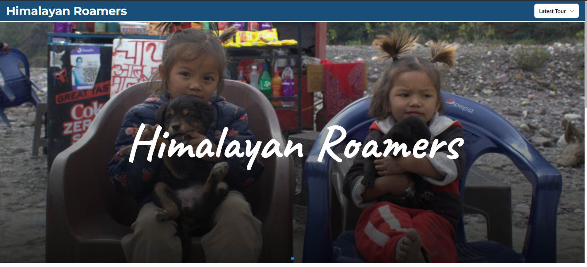

<p align="center">
  
</p>

<h1 align="center">🌄 Himalayan Roamers</h1>

<p align="center">
  Discover the unexplored beauty of the Himalayas with authentic blogs, itineraries, and travel tips.
</p>

---

## 🧭 About the Project

**Himalayan Roamers** is a travel blog website built by a group of adventure-loving students passionate about exploring places around Dehradun like Rishikesh, Mussoorie, Chakrata, and more. The goal is to create a digital space for sharing personal experiences, guides, images, and travel stories that inspire others to roam the Himalayas.

---

## ✨ Features

- 📝 **Curated Travel Blogs:** Honest, experience-based posts from real travelers.
- 📍 **Destination Highlights:** Get insights on routes, local culture, food, stay, and travel tips.
- 🖼️ **Beautiful Photo Gallery:** Real images clicked during our explorations.

---

## 🛠️ Tech Stack

- **Frontend:** React.js (Next.js migration planned), TailwindCSS, Framer Motion
- **Hosting:** Vercel

---

## 🚀 Installation & Setup

### 🧰 Prerequisites

Make sure you have the following installed:

- [Node.js](https://nodejs.org/)

---

### 📦 Steps to Set Up the Project Locally

#### 1. Clone the Repository

```bash
git clone [https://github.com/your-username/himalayan-roamers.git](https://github.com/DevSudhanshuRanjan/himalyan_roamers.git)
cd himalayan-roamers
